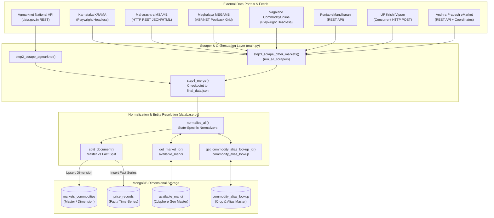
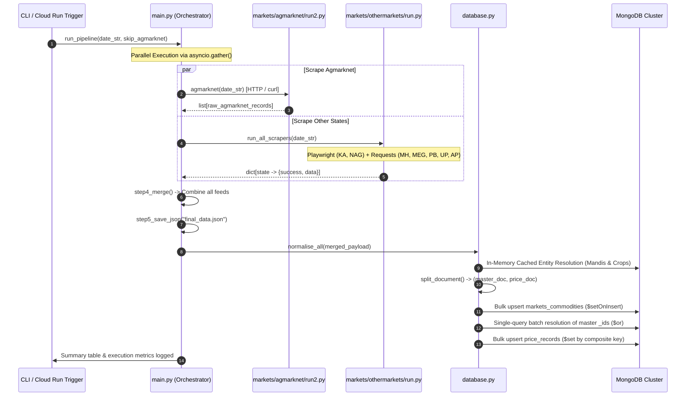
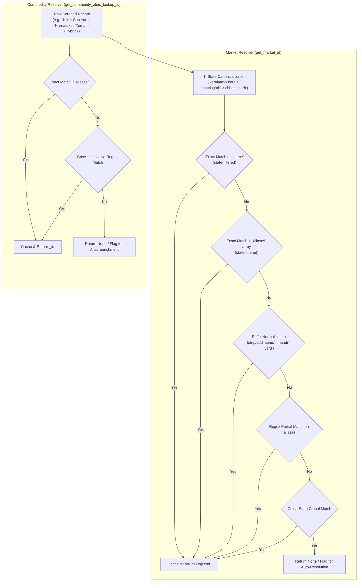

# 🌾 Indian APMC Mandi Intelligence & Universal Scraper Pipeline

[](https://www.python.org/downloads/)
[](https://www.mongodb.com/)
[](https://playwright.dev/)
[](https://modelcontextprotocol.io/)
[](https://www.docker.com/)

An enterprise-grade, distributed web scraping, data normalization, entity resolution, and dimensional modeling pipeline designed to ingest, harmonize, and store agricultural produce price and arrival data across India's network of APMC (*Agricultural Produce Market Committee*) mandis.

This system ingests data from central government feeds (**Agmarknet / data.gov.in**) and state-specific agricultural marketing board portals (**Karnataka, Maharashtra, Meghalaya, Nagaland, Punjab, Uttar Pradesh, Andhra Pradesh**), normalizes heterogeneous schemas into a unified dimensional star-schema on **MongoDB**, resolves messy vernacular and geographical entities, detects database anomalies, and exposes support operations via a **Model Context Protocol (MCP)** server.

---

## 📑 Table of Contents

1. [Architectural Overview](#-architectural-overview)
2. [End-to-End Execution Flow & Concurrency](#-end-to-end-execution-flow--concurrency)
3. [Integrated Data Sources & Scraper Engineering](#-integrated-data-sources--scraper-engineering)
4. [Database Architecture & Data Modeling](#-database-architecture--data-modeling)
5. [Entity Resolution & Cleansing Subsystems](#-entity-resolution--cleansing-subsystems)
6. [Data Integrity & Anomaly Auditing Engine](#-data-integrity--anomaly-auditing-engine)
7. [Model Context Protocol (MCP) Zoho Desk Server](#-model-context-protocol-mcp-zoho-desk-server)
8. [Installation & Environment Setup](#-installation--environment-setup)
9. [CLI Usage & Operating Instructions](#-cli-usage--operating-instructions)
10. [Docker Containerization & Cloud Deployment](#-docker-containerization--cloud-deployment)
11. [Repository Structure](#-repository-structure)

---

## 🏛️ Architectural Overview



---

## ⚡ End-to-End Execution Flow & Concurrency

The master orchestrator [`main.py`](file:///home/kishar/uni_scrapper/uni_scrapper/main.py) manages a non-blocking asynchronous pipeline leveraging Python's `asyncio` event loop and thread-pool executors:



---

## 🌐 Integrated Data Sources & Scraper Engineering

Every mandi portal presents unique technical requirements, ranging from anti-bot mechanisms, ASP.NET postback state-machines, and dynamic JavaScript rendering to rate-limited Elasticsearch backends:

| Source / Region | Target URL | Protocol & Ingestion Method | Concurrency / Driver | Key Characteristics & Parsing Logic |
| :--- | :--- | :--- | :--- | :--- |
| **Agmarknet (National)** | `api.data.gov.in/resource/9ef84268-d588-465a-a308-a864a43d0070` | REST API / HTTPS JSON | `requests.Session` + `curl` fallback | Handles 10,000 Elasticsearch window limit via state-partitioned pagination across 36 States/UTs with exponential backoff. |
| **Karnataka** | `krama.karnataka.gov.in/Reports/Main_rep` | ASP.NET WebForms HTML | Playwright Headless Chromium | Automates date entry, radio selection, and "All" pagination button with a 3-tier navigation fallback (`domcontentloaded` &rarr; `load` &rarr; `commit`). |
| **Maharashtra** | `msamb.com/ApmcDetail/DataGridBind` | HTTP GET / JSON-wrapped HTML | `requests` (Threaded) | Iterates all APMC codes defined in `utils/maharashtra.py` with custom ASP.NET session tokens and extracts HTML tables via BeautifulSoup. |
| **Meghalaya** | `megamb.gov.in/Public/MegambDailyReport.aspx` | ASP.NET Postback Grid | `requests.Session` + BeautifulSoup | State-machine extractor maintaining `__VIEWSTATE`, `__EVENTVALIDATION`, and stepping through `Page$Next` links. |
| **Nagaland** | `commodityonline.com/mandiprices/state/nagaland` | Dynamic HTML | Playwright Headless Chromium | Headless browser rendering DOM, stripping advertisement/social columns (e.g. Telegram share links), and extracting table matrices. |
| **Punjab** | `api.emandikaran-pb.in/CommonMasterDataAPI/getDailyArrival` | REST API / HTTPS JSON | `requests` (Threaded) | Path-parameterized date-range endpoint; maps localized market keys (`BranchName` &rarr; `Market`). |
| **Uttar Pradesh** | `upkrishivipran.in/Default.aspx/GetHomeCenterBhavDetails` | HTTP POST JSON | `httpx.AsyncClient` + `asyncio.Semaphore(30)` | Asynchronously evaluates the Cartesian product of Mandi Centers (`up_mandi_code`) and Commodity Groups (`up_product_category`). |
| **Andhra Pradesh** | `agriculture.ap.gov.in/staging/api/emarket/getMarketPriceData` | HTTP POST REST API | `requests` (Threaded) | Submits millisecond unix timestamp range payloads and extracts multi-tiered location UUIDs, commodity maps, and Geo coordinates. |

### Technical Deep-Dive: Agmarknet Elasticsearch Pagination Engine

The national feed endpoint enforces a strict Elasticsearch limit: `offset + limit <= 10,000`. On peak trading days with 15,000+ national records, an unfiltered query crashes with a `query_phase_execution_exception`.

[`markets/agmarknet/run2.py`](file:///home/kishar/uni_scrapper/uni_scrapper/markets/agmarknet/run2.py) resolves this via an intelligent state-partitioning algorithm:
1. **Probe Phase**: Dispatches a lightweight `limit=1` request to inspect total national volume.
2. **Dynamic Strategy Selection**:
   - If `total <= 10,000`, downloads the full payload in a single bulk request.
   - If `total > 10,000`, iterates through `KNOWN_STATES` (all 36 Indian states & union territories).
3. **State Scoped Pagination**: For each state, performs a `limit=1` probe. If records exist, paginates in chunks of `PAGE_SIZE` (default 10,000) using URL-encoded state filters (`filters[state.keyword]=...`).
4. **Resilience & Egress Recovery**: Handles flaky cloud egress connections (common on Google Cloud Run and GitHub Actions) with `HTTP_MAX_RETRIES=8`, connection drop detection (`RemoteDisconnected`, `ConnectionResetError`), and randomized exponential backoff with jitter.

---

## 🗄️ Database Architecture & Data Modeling

The MongoDB schema uses a **Normalized Dimensional Star-Schema** separating static dimensional metadata from high-frequency time-series price facts.

```
                    ┌──────────────────────────────────────────────┐
                    │               available_mandi                │
                    ├──────────────────────────────────────────────┤
                    │ _id : ObjectId                               │
                    │ name : string                                │
                    │ state : string                               │
                    │ district : string                            │
                    │ postcode : string                            │
                    │ aliases : array[string]                      │
                    │ location : Point [lon, lat] (2dsphere)       │
                    └──────────────────────┬───────────────────────┘
                                           │ 1:N
                                           ▼
┌──────────────────────────────┐ 1:N  ┌──────────────────────────────────────────────┐
│   commodity_alias_lookup     ├─────►│             markets_commodities              │
├──────────────────────────────┤      ├──────────────────────────────────────────────┤
│ _id : ObjectId               │      │ _id : ObjectId (PK)                          │
│ crop_master_id : string      │      │ source_system : string                       │
│ canonical_name : string      │      │ state : string                               │
│ aliases : array[string]      │      │ market_name : string                         │
│ confidence : double          │      │ market_id : ObjectId (FK -> available_mandi) │
│ source_tags : array[string]  │      │ commodity_alias_lookup_id : ObjectId (FK)    │
└──────────────────────────────┘      │ commodity_name : string                      │
                                      │ variety : string                             │
                                      │ grade : string                               │
                                      └──────────────────────┬───────────────────────┘
                                                             │ 1:N
                                                             ▼
                                      ┌──────────────────────────────────────────────┐
                                      │                price_records                 │
                                      ├──────────────────────────────────────────────┤
                                      │ _id : ObjectId (PK)                          │
                                      │ market_commodity_id : ObjectId (FK -> MC)    │
                                      │ market_id : ObjectId (Denormalized FK)       │
                                      │ commodity_alias_lookup_id : ObjectId (FK)    │
                                      │ date : Date (UTC BSON)                       │
                                      │ arrival_quantity : double (Tonnes/Quintals)  │
                                      │ min_price : double (Rs / Quintal)            │
                                      │ max_price : double (Rs / Quintal)            │
                                      │ modal_price : double (Rs / Quintal)          │
                                      │ ingested_at : string / Date                  │
                                      └──────────────────────────────────────────────┘
```

### 1. `markets_commodities` (Dimension Collection)
Stores unique combinations of markets, commodities, varieties, and source systems.
- **Compound Unique Index**: `unique_market_commodity` on `(source_system, state, market_name, commodity_name, variety)`
- **Lookup Indexes**: `idx_mc_state` on `(state)`, `idx_mc_commodity` on `(commodity_name)`
- **Write Policy**: Uses MongoDB `$setOnInsert` for immutable identity metadata and `$set` for refreshed entity foreign keys (`market_id`, `commodity_alias_lookup_id`).

### 2. `price_records` (Fact / Time-Series Collection)
Stores daily arrival volumes and pricing metrics.
- **Compound Unique Index**: `unique_price_entry` on `(market_commodity_id, date)`
- **Lookup Indexes**: `idx_pr_date` on `(date)`, `idx_pr_mc_id` on `(market_commodity_id)`
- **Denormalization Strategy**: `market_id` and `commodity_alias_lookup_id` are replicated directly into each price row to enable fast, join-free analytics.

### 3. `available_mandi` (Market Entity Master)
Maintains physical APMC mandi locations, official names, vernacular aliases, and postal details.
- **Geospatial Index**: `idx_location_2dsphere` on `location` (GeoJSON `Point` format: `[longitude, latitude]`)
- **Compound Unique Index**: `unique_state_name` on `(state, name)`

### 4. `commodity_alias_lookup` (Crop & Commodity Master)
Provides multilingual synonym mapping, phonetic aliases, and mapping to enterprise master crop IDs.
- **Text Search Index**: `idx_text_search` across `canonical_name` (weight 10), `aliases` (weight 5), and `language_variants` (weight 3).

---

## 🔍 Entity Resolution & Cleansing Subsystems

Raw mandi datasets contain spelling errors, varying state naming conventions, suffixes (e.g. *APMC, Yard, Sub-Market*), and regional language names. The resolution pipeline cleanses these records automatically:



### Date Normalization & Misparse Repair

Different sources format dates in ISO (`YYYY-MM-DD`), compact (`YYYYMMDD`), and Indian regional formats (`DD/MM/YYYY`).
- [`_parse_date`](file:///home/kishar/uni_scrapper/uni_scrapper/database.py#L54-L93) applies deterministic regex parsing before falling back to `dateutil`, preventing standard `YYYY-MM-DD` strings from being misparsed under `dayfirst=True`.
- [`repair_ap_iso_dayfirst_dates`](file:///home/kishar/uni_scrapper/uni_scrapper/database.py#L952-L1064) detects and repairs historical date swaps (e.g. `2026-08-12` flipped to `2026-12-08`) with transactional two-step bulk updates and duplicate deduplication.

---

## 🛡️ Data Integrity & Anomaly Auditing Engine

The repository includes dedicated verification tools to audit database health:

### `anomaly_check.py`
Runs a multi-point audit against live MongoDB instances:
1. **Null Field Scanner**: Identifies missing `market_id`, `commodity_alias_lookup_id`, `date`, or `modal_price` records.
2. **Future-Date Detector**: Flags and breaks down records with `date > UTC now`.
3. **Price Logic Validator**: Verifies mathematical consistency: $\text{min\_price} \le \text{modal\_price} \le \text{max\_price}$.
4. **Orphaned Fact Audit**: Scans `price_records` referencing non-existent `markets_commodities` documents.

### `resolving.py`
Audits and repairs cross-source discrepancies:
1. **Duplicate Diagnostic**: Detects duplicate entries arising from legacy source tags (`agmarknet` vs `agmarknet2`).
2. **Alias Merge Engine**: Merges historical price records onto canonical master documents and deletes redundant dimensional rows without data loss.

---

## ⚙️ Installation & Environment Setup

### Prerequisites
- **Python**: 3.11 or higher
- **MongoDB**: 4.4+ (local or MongoDB Atlas)
- **Chromium / Playwright**: Required for JavaScript scraping

### Setup Instructions

```bash
# 1. Clone the repository
git clone https://github.com/your-org/uni_scrapper.git
cd uni_scrapper

# 2. Create and activate a virtual environment
python3.11 -m venv .venv
source .venv/bin/activate

# 3. Install core dependencies
pip install --upgrade pip
pip install -r requirements.txt

# 4. Install Playwright browser binaries with system dependencies
python -m playwright install --with-deps chromium
```

### Environment Configuration (`.env`)

Create a `.env` file in the project root:

```env
# MongoDB Connection
MONGO_URI=mongodb+srv://<username>:<password>@<cluster>.mongodb.net/?retryWrites=true&w=majority
MANDI_DB_NAME=Price
MASTER_COLLECTION=markets_commodities
PRICE_COLLECTION=price_records
ALL_MANDI_COLLECTION=available_mandi

# Commodity & Alias Database
MONGO_URI_ANNAM=mongodb+srv://<username>:<password>@<cluster>.mongodb.net/?retryWrites=true&w=majority
MANDI_DB_NAME_ANNAM=agriai
COLLECTION_ANNAM=crop_master

# National Feed Configuration (data.gov.in)
DATA_GOV_IN_API_KEY=your_datagov_api_key_here
AGMARKNET_RESOURCE_ID=9ef84268-d588-465a-a308-a864a43d0070
AGMARKNET_PAGE_SIZE=10000
AGMARKNET_CONNECT_TIMEOUT=30
AGMARKNET_READ_TIMEOUT=180
AGMARKNET_HTTP_RETRIES=8

# Geocoding & Maps API
GOOGLE_MAPS_API_KEY=AIzaSy...

# Zoho Desk MCP Configuration
ZOHO_DOMAIN=zoho.in
ZOHO_CLIENT_ID=your_zoho_client_id
ZOHO_CLIENT_SECRET=your_zoho_client_secret
ZOHO_REFRESH_TOKEN=your_zoho_refresh_token
ZOHO_ORG_ID=your_zoho_org_id
```

---

## 🚀 CLI Usage & Operating Instructions

### Run the Full Daily Ingestion Pipeline

```bash
# Run for today's date across all 8 sources (Agmarknet + 7 states)
python main.py

# Run for a specific historical date (DD/MM/YYYY or YYYY-MM-DD)
python main.py --date 25/08/2026

# Run only state scrapers (skipping Agmarknet for quick testing)
python main.py --skip-agmarknet
```

### Run Standalone State Scrapers

```bash
# Test Agmarknet scraper independently
python markets/agmarknet/run2.py

# Test all other state scrapers and dump to JSON
python markets/othermarkets/run.py
```

### Run Entity Resolution & Database Maintenance

```bash
# Fast-resolve unmapped mandis using cached alias matching
python fast_resolve_all_mandis.py

# Geocode missing mandis via Google Maps API and backfill IDs
python maintenance/check_db.py

# Run comprehensive database anomaly checks
python maintenance/anomaly_check.py

# Run duplicate diagnostic and reconciliation
python maintenance/resolving.py --samples 10
python maintenance/resolving.py --merge --execute --skip-diagnose

# Repair misparsed ISO day-first dates (Dry Run)
python database.py --repair-ap-dates
# Execute repair
python database.py --repair-ap-dates --execute
```

---

## 🐳 Docker Containerization & Cloud Deployment

### Docker Build & Run

```bash
# Build the Docker image
docker build -t mandi-scraper:latest .

# Run container locally with environment file
docker run --rm --env-file .env mandi-scraper:latest
```

### Google Cloud Run Job Deployment

The container is configured to run as a **Cloud Run Job** on a scheduled cron:

```bash
# Deploy container to Google Artifact Registry / Cloud Run Jobs
gcloud run jobs create mandi-scraper-job \
    --image gcr.io/your-project/mandi-scraper:latest \
    --region asia-south1 \
    --memory 2Gi \
    --cpu 2 \
    --task-timeout 3600s \
    --set-env-vars MANDI_DB_NAME=Price

# Schedule execution daily at 18:00 IST via Cloud Scheduler
gcloud scheduler jobs create http mandi-daily-trigger \
    --schedule="0 18 * * *" \
    --time-zone="Asia/Kolkata" \
    --uri="https://asia-south1-run.googleapis.com/apis/run.googleapis.com/v1/namespaces/your-project/jobs/mandi-scraper-job:run" \
    --http-method POST \
    --oauth-service-account-email=your-sa@your-project.iam.gserviceaccount.com
```

---

## 📂 Repository Structure

```
.
├── .github/
│   └── workflows/
│       ├── ci.yml                 # CI Pipeline (pytest, flake8, syntax check)
│       └── dockerhub.yml          # Automated Docker Hub Image Build & Push
├── maintenance/                   # Database maintenance, backfill & audit utilities
│   ├── lookup_mandi_commodity/    # Excel-based commodity alias importer & schema setup
│   ├── lookup_market/             # Geocoded Excel loader & Google Maps Geocoding API
│   ├── agmarknetupdate.py         # Multi-day batch fetcher for Agmarknet
│   ├── anomaly_check.py           # Full MongoDB integrity and anomaly auditor
│   ├── backfill_commodity_aliases.py # Commodity alias linker & backfiller
│   ├── check_db.py                # Geocode missing mandis and backfill IDs
│   ├── export_null_alias_commodities.py # Export unlinked commodities to CSV
│   ├── fast_resolve_all_mandis.py # Fast in-memory market resolver & backfiller
│   ├── null_scan.py               # Field-level null & missing values auditor
│   ├── populate_and_backfill_aliases.py # Crop master fuzzy mapper & backfiller
│   ├── resolve_all_mandis.py      # Suffix-tolerant market resolver & backfiller
│   ├── resolving.py               # Duplicate diagnostic and resolution tool
│   └── upload_commodity_aliases.py# CSV commodity alias batch uploader
├── markets/
│   ├── agmarknet/
│   │   └── run2.py                # High-throughput data.gov.in scraper engine
│   └── othermarkets/
│       └── run.py                 # Aggregator for KA, MH, MEG, NAG, PB, UP, AP
├── tools/
│   ├── html_parser.py             # Karnataka HTML table parser
│   ├── maha_html_parse.py         # Maharashtra MSAMB HTML parser
│   └── nagaland_html_parser.py    # Nagaland table extractor
├── utils/
│   ├── maharashtra.py             # Maharashtra APMC code mapping dictionary
│   ├── sources.py                 # Master source registry dictionary
│   └── up_utils.py                # UP Mandi codes and Species Group mappings
├── tests/
│   ├── test_agmarknet_rate_limiting.py
│   └── test_parse_date.py
├── database.py                    # Schema definition, normalization & bulk uploader
├── main.py                        # Master pipeline orchestrator
├── Dockerfile                     # Production container recipe (Python 3.11-slim)
├── requirements.txt               # Locked Python dependencies
└── README.md                      # Technical documentation (this file)
```
