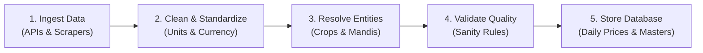

# 🌾 National Mandi Intelligence System (Uni-Scrapper) — User Guide

A clear, concise guide explaining what the **National Mandi Intelligence System** does, where it gets data, how it processes records, and how to run it.

---

## 📌 1. What the System Does

The **Uni-Scrapper** is an automated data collection and standardization pipeline for Indian agricultural markets (*APMC Mandis*). 

Every day, it:
1. **Scrapes Daily Market Data**: Fetches crop arrival volumes and wholesale prices (Min, Max, Modal) from national and state government portals.
2. **Cleans & Standardizes**: Converts irregular formats, standardizes units into quintals (100 kg), and formats currency into standard values.
3. **Resolves Names & Geocodes**: Maps vernacular/regional crop names to standard English names and links mandis to verified district and GPS coordinates.
4. **Validates Quality**: Applies logical sanity checks (e.g., verifying $\text{Min Price} \le \text{Modal Price} \le \text{Max Price}$) and filters duplicates.
5. **Stores & Syncs**: Saves structured records into a database for reporting, analysis, and API access.

---

## 🌐 2. Data Sources & Coverage

The system collects data from 1 national portal and 7 state-specific agricultural marketing boards:

| Source | Portal / Provider | Coverage | Key Commodities |
| :--- | :--- | :--- | :--- |
| **National (Agmarknet)** | `data.gov.in` API | All 36 States & UTs | All major crops nationwide |
| **Karnataka** | KRAMA (`krama.karnataka.gov.in`) | Karnataka Mandis | Ragi, Arecanut, Silk Cocoon, Maize, Tomato, Onion |
| **Maharashtra** | MSAMB (`msamb.com`) | Maharashtra Mandis | Onion (Nashik/Lasalgaon), Soybean, Cotton, Pomegranate, Grapes |
| **Meghalaya** | MEGAMB (`megamb.gov.in`) | Meghalaya Markets | Ginger, Lakadong Turmeric, Pineapple, Black Pepper |
| **Nagaland** | State Commodity Feed | Nagaland Markets | Naga Chilli, Cardamom, Bamboo Shoots, Maize |
| **Punjab** | eMandikaran (`emandikaran-pb.in`) | Punjab Mandis | Wheat, Paddy (Basmati & Non-Basmati), Cotton, Mustard |
| **Uttar Pradesh** | UP Krishi Vipran (`upkrishivipran.in`) | Uttar Pradesh Mandis | Potato, Wheat, Sugarcane, Mustard, Pulses |
| **Andhra Pradesh** | eMarket (`agriculture.ap.gov.in`) | Andhra Pradesh Mandis | Red Chilli (Guntur), Cotton, Tobacco, Groundnut, Sweet Lime |

---

## ⚙️ 3. How the Data Pipeline Works



1. **Ingestion**: Runs automated scrapers and API clients for each configured portal.
2. **Cleaning**: Extracts numerical prices, strips text artifacts (`"Rs."`, `"/Qtl"`), and normalizes dates.
3. **Entity Resolution**:
   - Translates regional crop names (e.g., *Batata*, *Aloo*, *Kanda*) to canonical commodity names (*Potato*, *Onion*).
   - Maps raw mandi strings to canonical market entities with latitude, longitude, and district.
4. **Validation**: Enforces mathematical rules:
   - Discards records with future dates or missing critical values.
   - Enforces $\text{Min Price} \le \text{Modal Price} \le \text{Max Price}$.
5. **Database Storage**: Upserts clean records into PostgreSQL/SQLite database tables.

---

## 📊 4. Data Fields Collected

Each daily price record contains the following standardized fields:

| Field Name | Description | Unit / Example |
| :--- | :--- | :--- |
| `State` | Name of the Indian State | `Maharashtra` |
| `Market Name` | Physical APMC mandi or market yard name | `Lasalgaon APMC` |
| `Commodity Name` | Standardized canonical crop name | `Onion` |
| `Variety` | Specific variety or commercial sub-type | `Red`, `Hybrid`, `Local` |
| `Grade` | Quality classification | `FAQ` (*Fair Average Quality*), `Grade A` |
| `Arrival Quantity` | Total volume brought into the mandi for the day | `450.00` Quintals (1 Qtl = 100 kg) |
| `Minimum Price` | Lowest traded price recorded in auction | ₹ per Quintal |
| `Maximum Price` | Highest traded price recorded in auction | ₹ per Quintal |
| `Modal Price` | Most common transaction price (benchmark rate) | ₹ per Quintal |
| `Date` | Trading date | `DD-MM-YYYY` |

---

## 🗺️ 5. Crop & Location Resolution

### Multi-Language Crop Mapping
The system maps regional and vernacular crop names across Hindi, Marathi, Kannada, Tamil, Telugu, Punjabi, and Bengali to a single standard name:

| Scraped Input | Standard Canonical Name | Category |
| :--- | :--- | :--- |
| *Batata / Aloo / Urulaikizhangu* | **Potato** | Vegetables |
| *Pyaaz / Kanda / Eerulli* | **Onion** | Vegetables |
| *Chana / Bengal Gram / Kadale* | **Gram (Chickpea)** | Pulses |
| *Makka / Bhutta / Musukina Jola* | **Maize** | Cereals |
| *Mirchi / Milagai / Menasinakai* | **Chilli** | Spices |
| *Gehun / Godhumai / Gothambu* | **Wheat** | Cereals |

### Mandi Geocoding
Mandi names with variations or sub-yard annotations (e.g., *"Pune APMC"*, *"Pune Sub-Yard"*, *"PUNE MANDI"*) are resolved to the primary market record with validated GPS coordinates and district mapping.

---

## 🤖 6. Zoho Desk Integration (Optional)

The system includes a **FastMCP** integration with Zoho Desk for support workflows:
- **Discrepancy Reporting**: Allows operators or AI agents to create tickets when data anomalies or mandi disputes are identified.
- **Ticket Queries**: Allows querying ticket status and customer inquiries directly through MCP tools.

---

## 🚀 7. Running the System

### Basic Commands

```bash
# 1. Run full daily scraping pipeline for today
python main.py

# 2. Scrape data for a specific date
python main.py --date 25/08/2026

# 3. Check for data anomalies and missing coordinates
python anomaly_check.py

# 4. Resolve and geocode newly detected mandis
python fast_resolve_all_mandis.py
```

### Execution Output
Upon completion, the pipeline displays an execution summary:

```text
========================================================================
SCRAPING STATUS SUMMARY
Source             Status        Records  Error
------------------ --------   ----------  --------------------
agmarknet          OK              14,280  
Karnataka          OK               1,450  
Maharashtra        OK               2,120  
Meghalaya          OK                 310  
Nagaland           OK                  85  
Punjab             OK                 890  
Uttar Pradesh      OK               3,420  
Andhra Pradesh     OK               1,150  
------------------------------------------------------------------------
Pipeline finished in 84.3 seconds. Total records: 23,705.
========================================================================
```
