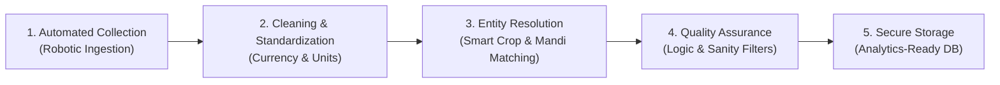

# 🌾 National Mandi Intelligence System — Non-Technical User Guide & Project Overview

Welcome to the **National Mandi Intelligence System** (*Uni-Scrapper*). This guide is designed for business stakeholders, agricultural analysts, commodity managers, product teams, and operations specialists who want to understand how the system works, what data it collects, and how it transforms fragmented government information into reliable agricultural intelligence.

---

## 📖 Quick Navigation

1. [Executive Summary & Why This System Exists](#-executive-summary--why-this-system-exists)
2. [The Business Value & Who Uses This Data](#-the-business-value--who-uses-this-data)
3. [The Sources: Where Our Data Comes From](#-the-sources-where-our-data-comes-from)
4. [How the System Works: The 5-Stage Data Journey](#-how-the-system-works-the-5-stage-data-journey)
5. [Understanding the Data (Plain English Guide to Fields)](#-understanding-the-data-plain-english-guide-to-fields)
6. [Smart Name Matching & Location Intelligence](#-smart-name-matching--location-intelligence)
7. [Data Quality & Protection Rules](#-data-quality--protection-rules)
8. [AI-Powered Helpdesk Integration (Zoho Desk)](#-ai-powered-helpdesk-integration-zoho-desk)
9. [How to Run and Check the System](#-how-to-run-and-check-the-system)
10. [Frequently Asked Questions (FAQ) & Glossary](#-frequently-asked-questions-faq--glossary)

---

## 🎯 Executive Summary & Why This System Exists

Across India, agricultural produce (such as wheat, tomatoes, onions, pulses, spices, and fruits) is traded daily across more than **7,000 regulated physical marketplaces** called **APMC Mandis** (*Agricultural Produce Market Committees*).

### The Challenge
Every day, prices fluctuate based on weather, supply arrivals, transport costs, and festival demand. However, tracking these prices has historically been painful:
- **Fragmented Portals**: Each state government maintains its own website or portal with completely different formats and login rules.
- **Language & Naming Barriers**: The same crop is called *"Batata"* in Maharashtra, *"Aloo"* in Uttar Pradesh, and *"Potato"* in central databases. Mandis are written with different spelling variations (e.g., *"Kolar APMC"*, *"Kolar Sub-Yard"*, *"Kolar Market"*).
- **Unreliable Web Infrastructure**: Government sites frequently crash, slow down, or display confusing date formats.

### The Solution
The **National Mandi Intelligence System** acts as a unified central brain:
1. It automatically visits national and state government websites every day.
2. It collects all price and arrival data across dozens of states.
3. It cleans, translates, and unifies crop and market names into standard categories.
4. It attaches precise GPS map coordinates and postal codes.
5. It stores this verified data in a central database ready for analytics, mobile apps, reports, and AI assistants.

---

## 💼 The Business Value & Who Uses This Data

```
┌─────────────────────────┐     ┌─────────────────────────┐     ┌─────────────────────────┐
│     Farmers & FPOs      │     │   Agri-Enterprises &    │     │   Fintech & Banks       │
│                         │     │   Commodity Traders     │     │                         │
│ • Know fair market rates│     │ • Plan supply chains    │     │ • Value crop collateral │
│ • Avoid distress sales  │     │ • Spot price arbitrage  │     │ • Assess loan risk      │
│ • Choose best mandi     │     │ • Forecast purchasing   │     │ • Insurance payouts     │
└─────────────────────────┘     └─────────────────────────┘     └─────────────────────────┘
```

* **Farmers & Farmer Producer Organizations (FPOs)**: Can compare prices across neighboring mandis before hiring transport, ensuring they sell where rates are highest.
* **Agribusinesses & Food Processors**: Track raw material procurement costs (e.g., tomato paste factories, flour mills, spice exporters).
* **Supply Chain & Logistics Companies**: Match truck capacity to mandis experiencing heavy harvest arrivals.
* **Banks, NBFCs & Crop Insurers**: Use historical price trends to assess agricultural loan risk and calculate fair crop insurance values.
* **Policymakers & Research Analysts**: Monitor food inflation and identify localized price spikes in real time.

---

## 🌐 The Sources: Where Our Data Comes From

Our system gathers price and arrival information from both the central Government of India and specialized state-level marketing boards.

```
                                  ┌───────────────────────┐
                                  │   Uni-Scrapper Core   │
                                  └───────────┬───────────┘
                                              │
        ┌───────────────────┬─────────────────┼─────────────────┬───────────────────┐
        ▼                   ▼                 ▼                 ▼                   ▼
┌───────────────┐   ┌───────────────┐ ┌───────────────┐ ┌───────────────┐   ┌───────────────┐
│ Agmarknet     │   │ Karnataka     │ │ Maharashtra   │ │ Meghalaya &   │   │ Punjab, UP    │
│ (National API)│   │ (KRAMA)       │ │ (MSAMB)       │ │ Nagaland      │   │ & Andhra P.   │
└───────────────┘   └───────────────┘ └───────────────┘ └───────────────┘   └───────────────┘
```

### 1. National Feed: Agmarknet (`data.gov.in`)
* **Coverage**: All 36 Indian States and Union Territories.
* **What it provides**: Daily price and arrival records across hundreds of commodities nationwide.
* **Role**: Serves as the primary national baseline covering major and minor mandis across the country.

### 2. Karnataka: KRAMA (`krama.karnataka.gov.in`)
* **Coverage**: All regulated mandis across Karnataka.
* **What it provides**: Auction prices, daily arrivals, and variety grades.
* **Key Commodities**: Ragi, Arecanut, Silk Cocoon, Maize, Coffee, Tomato, Onion.

### 3. Maharashtra: MSAMB (`msamb.com`)
* **Coverage**: Maharashtra State Agricultural Marketing Board network.
* **What it provides**: Detailed commodity grid data across central and western market yards.
* **Key Commodities**: Onion (*Nashik/Lasalgaon*), Soybean, Cotton, Pomegranate, Grapes, Sugarcane.

### 4. Meghalaya: MEGAMB (`megamb.gov.in`)
* **Coverage**: Northeastern mountain produce centers and border trade mandis.
* **What it provides**: Multi-page official daily reports.
* **Key Commodities**: Ginger, Turmeric (*Lakadong*), Pineapple, Broomstick, Black Pepper.

### 5. Nagaland: State Commodity Feed
* **Coverage**: Key commercial market centers in Nagaland.
* **What it provides**: Local retail and wholesale price tracking.
* **Key Commodities**: Naga Chilli, King Chilli, Cardamom, Bamboo shoots, Maize.

### 6. Punjab: eMandikaran (`emandikaran-pb.in`)
* **Coverage**: All grain market yards (*mandis*) across Punjab.
* **What it provides**: High-volume seasonal crop arrivals and procurement prices.
* **Key Commodities**: Wheat, Paddy (*Basmati & Non-Basmati*), Cotton, Mustard, Kinnow.

### 7. Uttar Pradesh: UP Krishi Vipran (`upkrishivipran.in`)
* **Coverage**: Mandi Parishad centers across the Gangetic plain.
* **What it provides**: Wholesale and retail rates for all crop categories.
* **Key Commodities**: Potato, Wheat, Sugarcane, Mango, Mustard, Pulses.

### 8. Andhra Pradesh: eMarket (`agriculture.ap.gov.in`)
* **Coverage**: Agricultural marketing centers across coastal and Rayalaseema regions.
* **What it provides**: Live transaction prices, arrival tonnages, and market GPS coordinates.
* **Key Commodities**: Red Chilli (*Guntur*), Cotton, Tobacco, Turmeric, Sweet Lime, Groundnut.

---

## 🔄 How the System Works: The 5-Stage Data Journey

Every day, thousands of raw records pass through five automated transformation stages before appearing on business dashboards:



### Stage 1: Automated Collection (Ingestion)
Early in the evening when mandis close trading, automated software robots visit each government portal. They read table pages, query secure government APIs, and download the day's raw transaction records.

### Stage 2: Cleaning & Standardization
Raw data often comes with inconsistent text like `"Rs. 2,450 / Qtl."` or missing columns. This stage:
- Cleans numbers into pure prices.
- Standardizes all weights into **Quintals** (1 Quintal = 100 Kilograms).
- Converts dates into a standardized universal time format.

### Stage 3: Entity Resolution (Smart Matching)
This is where messy local terms are linked to clean master records:
- Local dialect names are matched to universal English and scientific crop categories.
- Mandi names are linked to verified geographic database entries with real pin codes and district maps.

### Stage 4: Quality Assurance & Anomaly Screening
Before anything is saved, strict mathematical filters reject corrupt data:
- **Price Sanity Check**: Ensures that the minimum price is not greater than the maximum price.
- **Time Check**: Rejects any record claiming to be from the future.
- **Zero/Blank Check**: Discards completely empty or unpriced rows.

### Stage 5: Secure Storage & Indexing
The clean data is organized into a high-speed database. It is split into two organized views:
- **Master Directory**: Who the mandi is, where it is located, and what crops it trades.
- **Daily Price Records**: The day-by-day financial ticker of prices and arrival volumes.

---

## 📊 Understanding the Data (Plain English Guide to Fields)

When viewing reports or exported spreadsheets, here is what each field means:

| Field Name | What It Means | Why It Matters | Example |
| :--- | :--- | :--- | :--- |
| **State** | The Indian State where the mandi operates. | Geographic grouping and state-level policy analysis. | `Maharashtra` |
| **Market Name** | The specific physical mandi yard where produce was sold. | Identifies the physical trading location. | `Lasalgaon APMC` |
| **Commodity Name** | The standardized name of the agricultural crop. | Unified search regardless of regional dialect. | `Onion` |
| **Variety** | The specific biological or commercial sub-type of the crop. | Different varieties trade at vastly different prices. | `Red`, `Hybrid`, `Desi` |
| **Grade** | The quality rating of the harvested batch. | Premium grades earn higher prices. | `FAQ` (*Fair Average Quality*), `Grade A` |
| **Arrival Quantity** | Total volume of crop brought into the mandi on that date. | Shows supply pressure. High arrivals often mean falling prices. | `450.00` (*Quintals*) |
| **Minimum Price** | Lowest price recorded during the day's auction. | Shows the floor rate for lower quality produce. | `₹ 1,800` (*per Quintal*) |
| **Maximum Price** | Highest price paid by buyers during the day. | Shows peak price for premium quality produce. | `₹ 2,650` (*per Quintal*) |
| **Modal Price** | **The single most important price metric**: The price at which the majority of transactions occurred. | Represents the true, realistic market rate. | `₹ 2,300` (*per Quintal*) |
| **Date** | The trading day when the prices were recorded. | Enables time-series charts, weekly trends, and forecasting. | `25-Aug-2026` |

---

## 🗺️ Smart Name Matching & Location Intelligence

One of the biggest advantages of this system is its ability to make sense of messy naming conventions without requiring manual data entry.

```
                    ┌──────────────────────────────────────────────┐
                    │            Raw Scraped Input                 │
                    │   "Kolar Sub-Yard", "Tomato (Hybrid Local)"  │
                    └──────────────────────┬───────────────────────┘
                                           │
                    ┌──────────────────────▼───────────────────────┐
                    │      Intelligent Resolution Engine           │
                    │                                              │
                    │  1. Strips noise: "Sub-Yard", "APMC", "Mkt"  │
                    │  2. Maps vernacular: "Tamatar" ➔ "Tomato"    │
                    │  3. Matches State & District boundaries      │
                    └──────────────────────┬───────────────────────┘
                                           │
                    ┌──────────────────────▼───────────────────────┐
                    │       Verified Canonical Entity              │
                    │                                              │
                    │  • Clean Name: "Kolar APMC"                  │
                    │  • District: Kolar | State: Karnataka        │
                    │  • GPS: [78.1291° E, 13.1378° N]             │
                    │  • Standard Crop: Tomato                     │
                    └──────────────────────────────────────────────┘
```

### 1. The Mandi Resolver
If a government portal writes *"pune sub yard"*, *"Pune APMC"*, or *"PUNE MANDI"*, the system automatically recognizes that all three refer to the same physical location in Pune, Maharashtra. It links the record to verified Google Maps latitude and longitude coordinates.

### 2. The Crop & Alias Dictionary
The system maintains a comprehensive dictionary of Indian crop names across multiple languages (Hindi, Marathi, Kannada, Tamil, Telugu, Punjabi, Bengali, and English):

| Local / Scraped Term | Matched Canonical Name | Crop Category |
| :--- | :--- | :--- |
| *Batata / Aloo / Urulaikizhangu* | **Potato** | Vegetables |
| *Pyaaz / Kanda / Eerulli* | **Onion** | Vegetables |
| *Chana / Bengal Gram / Kadale* | **Gram (Chickpea)** | Pulses |
| *Makka / Bhutta / Musukina Jola*| **Maize** | Cereals |
| *Mirchi / Milagai / Menasinakai*| **Chilli (Green/Red)** | Spices |
| *Gehun / Godhumai / Gothambu*  | **Wheat** | Cereals |

---

## 🛡️ Data Quality & Protection Rules

To ensure downstream financial models and decision-makers never receive corrupted data, the system enforces strict validation rules:

1. **The Price Triangle Rule**:
   $$\text{Minimum Price} \le \text{Modal Price} \le \text{Maximum Price}$$
   If any government portal accidentally flips these numbers, the system flags and corrects the entry.
2. **The Time Machine Block**:
   Any record with a date in the future is automatically blocked from the main reporting tables.
3. **No Duplicate Double-Counting**:
   If a price update is run multiple times in one day, the system updates the existing record rather than creating duplicate entries.
4. **Permanent Audit Trail**:
   Every record keeps a timestamp of when it was fetched (`ingested_at`) and links back to the original government web source.

---

## 🤖 AI-Powered Helpdesk Integration (Zoho Desk)

For enterprise operations, customer support, and discrepancy reporting, the system is connected to **Zoho Desk** using the **Model Context Protocol (MCP)**.

```
┌─────────────────────────────────┐           ┌─────────────────────────────────┐
│     AI Assistant / Chatbot      │           │         Zoho Desk CRM           │
│                                 │  FastMCP  │                                 │
│ • "Show tickets for Nashik"     │ ◄───────► │ • Customer Inquiries            │
│ • "Log price discrepancy"       │           │ • Data Correction Requests      │
│ • "Check ticket status #1042"   │           │ • Department Routing            │
└─────────────────────────────────┘           └─────────────────────────────────┘
```

### What This Enables:
* **Instant Discrepancy Reporting**: If a field officer notices a price mismatch in a specific mandi, an AI agent can log a support ticket directly in Zoho Desk.
* **Automated Ticket Lookup**: Non-technical team members can ask natural language questions like *"What are the open data inquiries for the Guntur Chilli market?"* and get instant answers from Zoho Desk.
* **Automatic Status Updates**: Resolving or commenting on support issues is handled through secure automated tools.

---

## 🚀 How to Run and Check the System

While the system is designed to run automatically in the cloud on a daily schedule, team members can also trigger runs and audit reports manually.

### Common Operational Tasks

```bash
# 1. Run the daily collection for today's date
python main.py

# 2. Collect data for a specific past date
python main.py --date 25/08/2026

# 3. Check database health and find any missing locations
python anomaly_check.py

# 4. Resolve and map any newly discovered mandis
python fast_resolve_all_mandis.py
```

### Reading the Execution Summary
At the end of every run, the system outputs a clear summary table:

```
========================================================================
SCRAPING STATUS SUMMARY
Source             Status        Records  Error
------------------ --------   ----------  --------------------
agmarknet          OK              14,280  
Karnataka          OK               1,450  
Maharashtra        OK               2,120  
Meghalaya          OK                 310  
Nagaland           OK                  85  
Punjab             OK                 890  
Uttar Pradesh      OK               3,420  
Andhra Pradesh     OK               1,150  
------------------------------------------------------------------------
Pipeline finished in 84.3 seconds. Total records: 23,705.
========================================================================
```

---

## ❓ Frequently Asked Questions (FAQ) & Glossary

### Frequently Asked Questions

#### Q1: What happens if a state government website goes down?
**A**: The system runs each state independently. If one state portal is offline or timing out, the system safely records an error message for that state while continuing to collect and save data from all other 7 sources.

#### Q2: How often is the data updated?
**A**: Most APMC mandis conduct auctions between morning and late afternoon. The automated pipeline is scheduled to run daily in the evening (typically around 6:00 PM IST) to capture the complete day's trade.

#### Q3: What happens when a brand-new mandi or crop appears?
**A**: The system's resolver automatically captures the new entry, stores it as a new candidate, and attempts to find its GPS coordinates and district using Google Maps geocoding.

#### Q4: Why are some price fields blank?
**A**: Occasionally, a mandi records that a crop arrived in the market yard (*Arrival Quantity*), but trading was postponed or not finalized that day, leaving the price fields blank. The system preserves the arrival volume while marking prices as unrecorded.

---

### 📚 Agricultural Market Glossary

* **APMC (*Agricultural Produce Market Committee*)**: A statutory board established by state governments in India to ensure fair trading practices and price transparency in agricultural markets.
* **Mandi**: The physical wholesale marketplace or yard where farmers bring produce to sell to licensed traders through open auctions.
* **Quintal**: The standard commercial unit of agricultural weight in India. $1\text{ Quintal} = 100\text{ kg} = 0.1\text{ Tonne}$.
* **Modal Price**: The most common price at which the largest volume of a commodity was traded on a specific day. This is the most accurate benchmark of market value.
* **Arrivals**: The total quantity of produce that arrived in the market yard on that day.
* **FAQ (*Fair Average Quality*)**: The standard commercial grade denoting clean, dry, defect-free produce meeting regular market specifications.
* **Kharif & Rabi**: The two primary agricultural crop seasons in India. *Kharif* crops are monsoon-sown (harvested autumn/winter), while *Rabi* crops are winter-sown (harvested spring/summer).
* **FPO (*Farmer Producer Organization*)**: A collective of farmers formed to improve their bargaining power and access better market prices.
